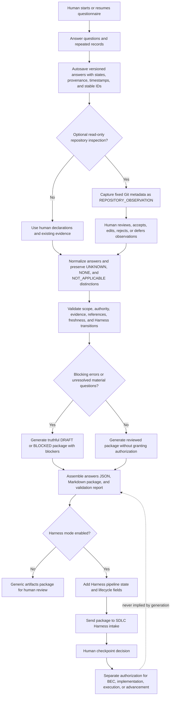

# Reusable Artifacts Package Questionnaire

This tool helps a human create a bounded, evidence-grounded handoff package for a project. It collects project intent, scope, requirements, decisions, risks, evidence, authority boundaries, and next-step instructions, then generates a machine-readable answer file and Markdown package.

It does **not** implement the documented project. It does not deploy, publish, mutate data, modify the target repository, call external AI services, call Gortex, or grant permission to begin the next project phase.

## Requirements

- Python 3.10 or newer
- A readable copy of the supplied artifacts-package template
- A terminal on Windows, macOS, or Linux

The questionnaire CLI uses Python’s standard library. The optional v0.3
requirements gateway additionally requires JSON Schema support:

```text
python -m pip install -r requirements.txt
```

## Start a questionnaire

From the project directory, run:

```text
python tools/artifacts_package_questionnaire.py start --answers answers.json
```

The script asks one question at a time. It autosaves after each accepted answer, so `answers.json` can be used to resume later.

Each terminal prompt includes a **What this question means** explanation and a
safe example. When a prior answer makes a dependent question inapplicable, the
CLI skips it and records the reason as derived metadata. Guidance and routing
never infer human approvals, authority, requirements, priorities, or risk
acceptance; those always require an explicit human answer.

During the questionnaire, these commands are available:

- `back` moves to the previous question.
- `edit <question-id>` jumps to a question, for example `edit PKG-001`.
- `save` saves the current answer file.
- `review` displays the normalized answers collected so far.
- `quit` saves and exits.
- For repeated sections, `done` finishes the section and `cancel` abandons the incomplete record.

Repeated records are entered one field at a time. The script assigns stable IDs such as `ACT-001`, `FR-001`, `AC-001`, and `EVD-001` only after a record is complete. Deleted IDs are not reused.

Do not enter passwords, API keys, tokens, credentials, private payloads, or regulated personal data. Use `UNKNOWN`, `NOT_APPLICABLE`, `TO_BE_INSPECTED`, or `DEFERRED` when the answer is not available. Do not use an empty answer to imply `NO`, `NONE`, approval, or authorization.

## Start the local intake UI

The local intake UI lets a reviewer upload a pre-artifacts Markdown file,
acknowledge local restricted-content handling, seed a draft questionnaire,
save human answers for missing fields, confirm/reject seeded answers and
records, and review fields grouped by urgency.

```text
python tools/artifacts_package_questionnaire.py intake-ui --workspace . --port 8765 --open
```

The UI is ArtPkg-owned. It does not grant approval, implementation authority,
execution authority, publication authority, deployment authority, or permission
to process sensitive content. Local sessions are written under `.artpkg/` and
are gitignored because they can contain project-specific or restricted
information. Building a readiness projection writes Archify IR, mapping,
projection-validation, rendered HTML, and local Archify receipt files into the
session directory.

## Resume a saved questionnaire

```text
python tools/artifacts_package_questionnaire.py resume --answers answers.json
```

The saved file retains answer states, provenance, timestamps, stable IDs, and answer history. Schema `0.1` answer files are migrated deterministically to schema `0.2` when loaded. Unsupported schema versions are rejected.

## Validate answers

```text
python tools/artifacts_package_questionnaire.py validate --answers answers.json
```

Validation reports:

- errors, warnings, unresolved material answers, and blocking IDs;
- cross-reference and evidence failures;
- authority and scope problems;
- Gate A through Gate D readiness results;
- the next permitted action.

A package can be generated while it is `DRAFT` or `BLOCKED`, but validation must never be treated as human approval.

## Apply a decision-resolution addendum

Use `apply-addendum` when a human-supplied addendum closes or narrows package
decisions after the first ArtPkg pass.

```text
python tools/artifacts_package_questionnaire.py apply-addendum --answers artifacts_package_answers.json --addendum C:\Users\vin\Downloads\artpkg-decision-resolution-addendum-v0.2.md --generate --yes
```

The command preserves the addendum as supporting evidence, records accepted
decisions as human declarations, keeps `AUT-001` at `NOT_EVALUATED`, and keeps
PH-001 blocked until the remaining P1 questions and explicit implementation
authorization are recorded.

## Generate the package

```text
python tools/artifacts_package_questionnaire.py generate --answers answers.json
```

Generation refuses to overwrite an existing output. After reviewing the validation result, explicitly permit overwriting with:

```text
python tools/artifacts_package_questionnaire.py generate --answers answers.json --yes
```

Generation is deterministic for the same normalized answers and template. The validation report contains digests for the answer file and generated package files; it intentionally excludes its own digest to avoid recursive content.

## Package generation workflow

The following workflow shows how human input and optional read-only repository
observations become the package sent to the SDLC Harness. Human declarations,
repository observations, and runtime evidence remain labeled separately during
normalization and validation.



The Harness receives the generated artifacts package as evidence and durable
context. Sending or generating it does not activate a BEC, authorize
implementation or execution, accept a checkpoint, or authorize advancement.

## Output files

The output location is recorded in the answer file setup. Generic compact mode produces:

```text
artifacts_package_answers.json
artifacts_package.md
artifacts_package_validation.md
```

Generic standard mode produces:

```text
artifacts_package_answers.json
artifacts_package_validation.md
00-overview-and-current-state.md
01-requirements-and-acceptance.md
02-architecture-and-feature-map.md
03-decisions-risks-and-boundaries.md
04-build-sequence-and-validation.md
05-artifact-index-and-evidence-ledger.md
```

## SDLC Harness mode

Set the controlling Harness answer `HAR-000` to `YES` when the package will be consumed by the Evidence-First SDLC Harness pipeline. Harness mode records pipeline stage, repository snapshot, dirty-state metadata, discovery classification, BEC lifecycle, implementation and execution authority, verification, checkpoint acceptance, and separately authorized advancement.

Harness mode does not activate a BEC or authorize work. Discovery results are evidence only. Empty discovery means `NOT_FOUND_BY_THIS_METHOD`, not proof of absence. Partial, noisy, stale, or contradictory discovery requires fallback or human disposition.

Harness compact mode produces the three generic compact files plus Harness state inside `artifacts_package.md`. Harness standard mode produces nine files:

```text
artifacts_package_answers.json
artifacts_package_validation.md
00-overview-and-current-state.md
01-requirements-and-acceptance.md
02-architecture-and-feature-map.md
03-decisions-risks-and-boundaries.md
04-build-sequence-and-validation.md
05-artifact-index-and-evidence-ledger.md
06-sdlc-harness-pipeline.md
```

A discovery package should normally show:

```text
Pipeline stage: DISCOVERY
Active BEC: NONE
Implementation authorization: NONE
Execution authorization: NONE
Checkpoint acceptance: NOT_EVALUATED
Next permitted action: HUMAN_REVIEW_ONLY
```

An implementation-handoff package remains blocked until the accepted BEC, exact scope, authority, acceptance criteria, validation plan, evidence, and stop conditions are recorded.

## v0.3 requirements gateway

ArtPkg v0.3 adds two linked artifacts for Pipeline-A consumption:
`REQUIREMENT_INTAKE` is the immutable, human-approved requirement authority,
and `EVIDENCE_ENRICHED_SCOPE` binds one proposed candidate to an embedded,
content-addressed approved requirement snapshot that is verified against a
separately supplied current ArtPkg 1 intake. Evidence may support scope
interpretation but cannot derive or modify a requirement. The v0.3 helpers are
in `tools/artpkg_v03.py`; they do not implement or claim Pipeline-A enforcement.

Legacy v0.1/v0.2 artifacts remain readable and renderable. Under v0.3-aware
logic they are `GENERAL` with `requirement_authority: UNVERIFIED_LEGACY` and
cannot authorize a DWO until explicitly re-attested in a v0.3 intake.

## Repository inspection

Read-only inspection is disabled by default. When explicitly enabled, the fixed-function inspector collects only safe Git metadata such as repository identity, commit, branch, status, tracked paths, and untracked paths. It does not inspect arbitrary content, modify the repository, execute project commands, access secrets, or invoke Gortex.

All inspection observations are labeled `REPOSITORY_OBSERVATION` and cannot create human approval, authority, accepted scope, requirement priority, risk acceptance, or correctness claims.

## Safety boundary

The generated package is a handoff and review artifact, not an authorization record. Human reviewers must separately decide whether to accept a checkpoint, activate a BEC, authorize implementation or execution, or advance to another phase.

For the detailed question catalogue, validation rules, and output contract, see [reusable_artifacts_package_human_questionnaire_spec.md](reusable_artifacts_package_human_questionnaire_spec.md). For the operator-oriented implementation notes, see [docs/artifacts_package_questionnaire.md](docs/artifacts_package_questionnaire.md).
